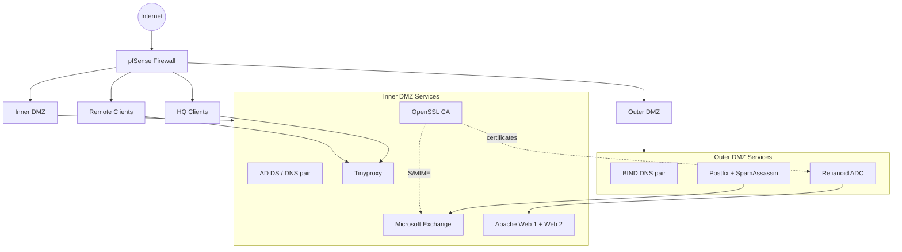

# Enterprise Web & Security Infrastructure

Sanitized portfolio documentation for a **Spring 2026 Purdue University CNIT 34220** team project that built a segmented multi-site enterprise environment and progressively added identity, DNS, email, web, availability, PKI, and security controls.

> This is a public portfolio reconstruction, not a copy of the course submission. Credentials, private keys, internal infrastructure details, and complete answer configurations are intentionally excluded.

## Project highlights

- pfSense segmentation across WAN, Outer DMZ, Inner DMZ, HQ, and Remote zones
- Redundant BIND DNS servers
- Redundant Active Directory domain controllers and internal DNS
- NAT and controlled inter-zone traffic
- Microsoft Exchange internal mailbox services
- Postfix SMTP relay in the Outer DMZ
- SpamAssassin filtering
- Redundant Apache web servers
- Tinyproxy transparent proxy
- Relianoid ADC load balancing, health checks, and failover
- OpenSSL PKI and X.509 certificates
- TLS/HTTPS
- DNSSEC
- SPF, DKIM, DMARC
- S/MIME
- Centralized time synchronization

## Simplified architecture

## Infrastructure evolution

1. **Infrastructure & DNS:** pfSense zones, BIND, Active Directory, DNS forwarding, domain clients, NAT.
2. **Enterprise email:** Exchange, Postfix relay, SpamAssassin, mail DNS records, NTP.
3. **Web services:** Apache redundancy, Tinyproxy, pfSense NAT redirect, Relianoid ADC load balancing/failover.
4. **PKI & security:** OpenSSL CA, X.509/TLS, DNSSEC, SPF, DKIM, DMARC, S/MIME.

## Representative configs

- [BIND](configs/bind/named.conf.example)
- [DNS zone](configs/bind/example.net.zone)
- [Postfix](configs/postfix/main.cf.example)
- [Apache](configs/apache/site.conf.example)
- [Tinyproxy](configs/tinyproxy/tinyproxy.conf.example)
- [Mail-security DNS](configs/mail-security/dns-records.example)
- [pfSense policy model](configs/pfsense/firewall-policy.md)
- [ADC backend pool](configs/relianoid/backend-pool.md)

## Verification scripts

- [DNSSEC](scripts/verify-dnssec.sh)
- [SPF / DKIM / DMARC](scripts/verify-mail-auth.sh)
- [HTTPS / certificate](scripts/verify-web.sh)

## Documentation

- [Architecture](docs/architecture.md)
- [DNS & identity](docs/dns-identity.md)
- [Email infrastructure](docs/email-infrastructure.md)
- [Web services](docs/web-services.md)
- [PKI & DNSSEC](docs/pki-dnssec.md)
- [Troubleshooting](docs/troubleshooting.md)

## Troubleshooting highlights

- Recreated an incorrectly configured AD-integrated reverse DNS zone so PTR records populated correctly.
- Diagnosed a DNSSEC issue caused by an outdated SOA serial and validated RRSIG responses after correction.
- Corrected OpenDKIM key-directory ownership so the signing service could access private key material.
- Used `named-checkzone` to identify malformed DNS TXT records before restarting BIND.
- Validated Exchange/Postfix mail flow through the DMZ relay.
- Verified ADC backend health, failover, and TLS termination.

## What I learned

- How DMZ segmentation reduces exposure between public and internal services.
- Why DNS, identity, mail, web, and PKI must be troubleshot as interdependent services.
- How hybrid Windows/Linux environments change administrative workflows.
- How PKI, DNSSEC, SPF/DKIM/DMARC, TLS, and S/MIME protect different trust boundaries.
- Why DNS serials, permissions, time synchronization, and firewall policy often become root causes of larger application failures.

## Academic context

This was a **team-based academic implementation** completed during Spring 2026. This repository focuses on architecture, configuration patterns, validation, and troubleshooting rather than reproducing the original course instructions.
