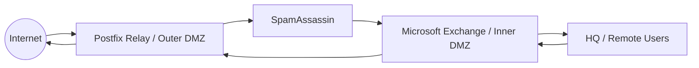

# Enterprise email infrastructure

Postfix acted as the public SMTP relay so the internal Exchange server was not directly exposed to Internet SMTP. Exchange supplied mailbox and OWA services. SpamAssassin was integrated at the relay layer and validated with the standard GTUBE test pattern in the lab environment.

Mail flow depended on correct MX, A, PTR, SPF, DKIM, and DMARC records, so DNS validation was part of mail troubleshooting.
